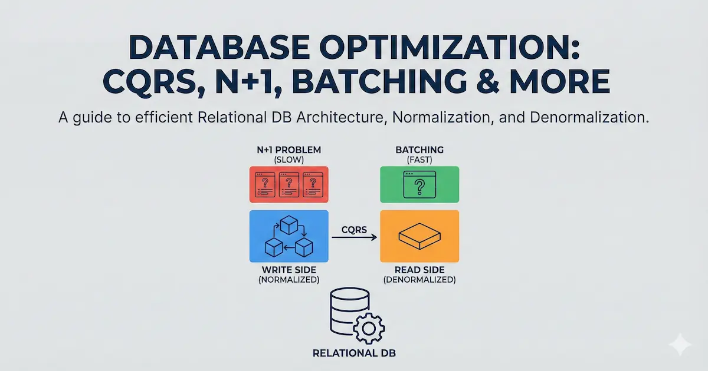

### Normalized, Denormalized, N + 1 to CQRS?

A demo implementation demonstrating N+1 queries, batch querying, normalization, denormalization, projections, caching, and CQRS patterns.



**Setup**

1. Install dependencies

   ```bash
   pnpm install
   ```

2. Configure environment

   ```bash
   cp env.example .env
   ```

   Update `.env` with your database credentials.

3. Start services

   ```bash
   docker compose up -d
   ```

4. Run migrations

   ```bash
   pnpm db:push
   ```

5. Seed database

   ```bash
   pnpm db:seed
   ```

6. Build projection table

   ```bash
   curl -X POST http://localhost:3000/api/project
   ```

   Or in code:

   ```ts
   import { runFullProjection } from "@/jobs/projection-full";
   await runFullProjection();
   ```

7. Start dev server

   ```bash
   pnpm dev
   ```

**Examples**

- `/nplusone` - N+1 query problem demonstration
- `/nplusoneresolved` - Batch querying solution
- `/denormalized` - Denormalized read model
- `/optimized` - ISR + Redis caching

**Scripts**

- `pnpm db:generate` - Generate migration files
- `pnpm db:push` - Push schema to database (dev)
- `pnpm db:migrate` - Run migrations (prod)
- `pnpm db:seed` - Seed database with sample data
- `pnpm db:studio` - Open Drizzle Studio

**Projection**

The projection table (`deposts`) is built from normalized tables. Trigger it via the API endpoint `POST /api/project` or import and call `runFullProjection()` directly.

**Documentation**

- [Read part 1](./docs/part1.md) - Understanding N+1, normalization, denormalization, and CQRS
- [Read part 2](./docs/part2.md) - Hands-on example in Next.js with walkthrough