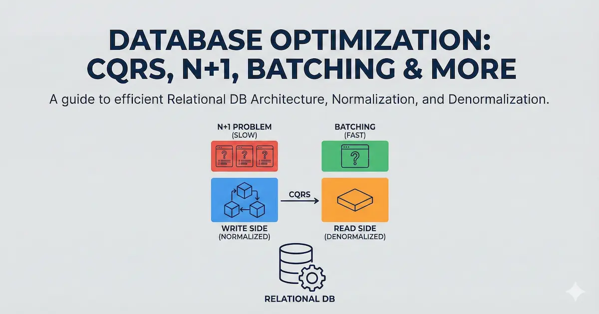

# From N+1 to CQRS: A Database Optimization Journey

Normalized? Denormalized? Projection Builder? Why does it all feel like a confusing maze?

This repository is a hands-on lab designed to take you from the "Pain" of inefficient N+1 queries to the "Peace" of optimized read models and high-performance caching.



## 🚀 Quick Start

Get the lab running in less than 2 minutes.

### 1. Install Dependencies

```bash
pnpm install
```

### 2. Configure Environment

```bash
cp .env.example .env
```

> [!NOTE]
> Update `.env` with your database credentials. If you're using the included docker-compose, the defaults will just work.

### 3. Start the Lab

```bash
docker compose up -d   # Start Postgres & Redis
pnpm db:push          # Push schema with Drizzle
pnpm db:seed          # Populate with sample data
pnpm dev              # Fire up the Next.js app
```

### 4. Build the Read Model

```bash
curl -X POST http://localhost:3000/api/project
```

## What's Inside?

We've built a series of comparison pages so you can see the performance difference for yourself:

- `/nplusone` - **The Problem**: 1 + N queries. Watch your DB sweat.
- `/nplusoneresolved` - **The Fix**: Batch fetching. 2 queries, total.
- `/denormalized` - **The Cheat Code**: Single query reads from a pre-computed table.
- `/optimized` - **The Shield**: Static regeneration with ISR.
- `/apioptimized` - **The Resilience**: Serverless API pattern with Redis & Retries.

## Tooling & Scripts

- `pnpm db:generate` - Generate Drizzle migration files
- `pnpm db:push` - Sync schema directly (dev)
- `pnpm db:seed` - Seed with fresh sample data
- `pnpm db:studio` - Inspect your data via Drizzle Studio

## Deep Dive (Read the Guide)

Don't just run the code—understand the "Why."

1. [**Part 1: The Theory**](./docs/part1.md) - Understanding N+1, the value of Normalization vs Denormalization, and when to use CQRS.
2. [**Part 2: The Hands-on**](./docs/part2.md) - A step-by-step walkthrough of the implementation details of this repo.
